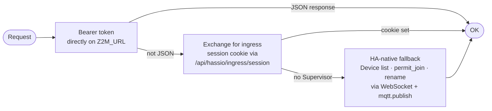

# Z2M authentication

`Z2MClient` tries three authentication strategies in order, falling back automatically if one fails.

## Strategies

### 1. Bearer token

The HA long-lived token is sent as a `Bearer` header directly to `Z2M_URL`. This works when Z2M is exposed with token-based auth.

### 2. Ingress session cookie

If the response is not JSON (e.g. an HTML login page), zigporter exchanges the HA token for an ingress session cookie via the Supervisor API at `/api/hassio/ingress/session`. This is the standard flow for accessing add-ons through the HA ingress proxy.

### 3. HA-native fallback

If the Supervisor is unavailable (e.g. running HA Core without the add-on infrastructure), zigporter falls back to driving Z2M entirely through Home Assistant:

- Device listing via the HA entity registry (WebSocket)
- `permit_join` via `mqtt.publish` service call
- Rename via `mqtt.publish` to the Z2M rename topic
