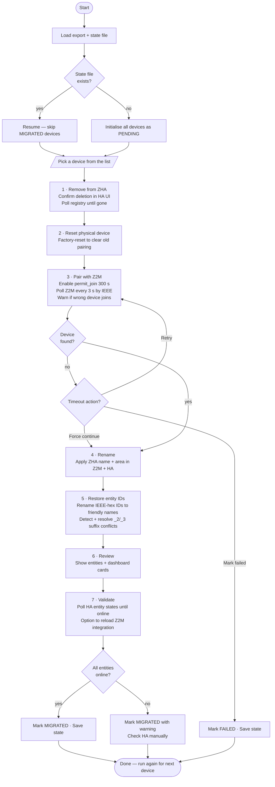
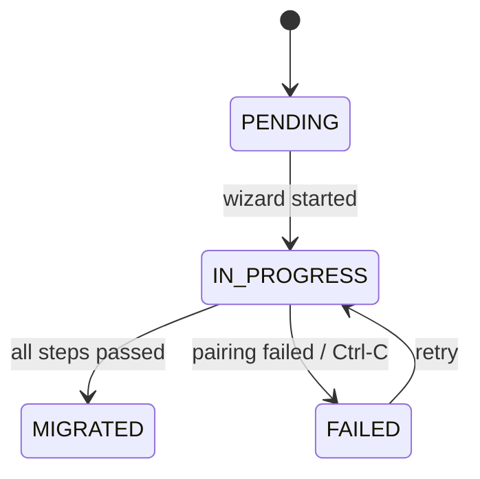

# Migration wizard

The wizard migrates one device at a time. Run it with:

```bash
zigporter migrate [ZHA_EXPORT]
```

> **Back up first** — The wizard removes devices from ZHA and rewrites entity IDs,
> automations, and dashboards. These changes are difficult to reverse. Before running,
> [back up your Home Assistant configuration](https://www.home-assistant.io/common-tasks/os/#backups).
> This tool is provided **as-is** with no warranty. Use at your own risk.

`ZHA_EXPORT` defaults to `~/.config/zigporter/zha-export.json` (auto-created by `zigporter export`).
Check progress without entering the wizard:

```bash
zigporter migrate --status
```

On the first non-status run, `zigporter` requires a one-time backup confirmation and stores
that acknowledgment in `~/.config/zigporter/.backup-confirmed`.

## Steps

Each device passes through seven steps:

1. **Remove from ZHA** — triggers removal via the HA WebSocket API and polls the device registry until the device is gone
2. **Reset device** — prompts you to factory-reset the physical device to clear the old pairing
3. **Pair with Z2M** — opens a 300 s permit-join window and polls Z2M every 3 s by IEEE address; warns immediately if a different device joins by mistake
4. **Rename** — applies the original ZHA friendly name and area assignment in Z2M and HA
5. **Restore entity IDs** — renames IEEE-hex entity IDs back to friendly names; runs a second pass to detect `_2`/`_3` suffix conflicts (caused by stale ZHA entries still occupying the original IDs), prompts to delete the stale entities, and renames the suffixed Z2M entities back to their original names
6. **Review** — displays current entity IDs and all Lovelace dashboard cards that reference them
7. **Validate** — polls HA entity states until all entities come online; offers a "Reload Z2M integration in HA, then retry" option to force-refresh sensor state without leaving the CLI

### Pairing timeout options

If the 300 s pairing window expires without detecting the device, the wizard offers three choices:

- **Retry** — opens a new 300 s window
- **Force continue** — use this when you can see the device in Z2M with a green interview but automatic detection failed; the wizard proceeds using the IEEE address as a fallback name and the rename step corrects it
- **Mark as failed** — skip the device and revisit it later

## State persistence

Progress is written to `zha-migration-state.json` after every transition. Pressing `Ctrl-C` at any point marks the current device `FAILED` and saves — rerun the wizard to retry.

## Flow



## Post-migration cleanup with `fix-device`

If a device was migrated before the suffix-conflict fix was added, or if the wizard was
interrupted before step 5 completed, stale ZHA entries may still be present in the HA
registry. This causes HA to append `_2`/`_3` suffixes to Z2M entity IDs, breaking
dashboard cards that reference the original names.

Run the standalone cleanup command to resolve this:

```bash
zigporter fix-device
```

The command:

1. Fetches the HA device and entity registries
2. Finds devices that have both a stale ZHA entry and an active Z2M entry
3. Shows a plan (entities to delete, entities to rename)
4. On confirmation: deletes the stale ZHA entities, removes the ZHA device from the
   registry, and renames any `_N` suffixed Z2M entities back to their original IDs

## Reverse migration (Z2M → ZHA)

To migrate devices back from Zigbee2MQTT to ZHA, snapshot your Z2M state first, then run the reverse wizard:

```bash
zigporter export-z2m                      # writes ~/.config/zigporter/z2m-export.json
zigporter migrate --direction z2m-to-zha
```

The reverse wizard mirrors the forward wizard — same 7 steps plus an optional rename:

1. **Remove from Z2M** — publishes `{"id": name, "force": true}` to `zigbee2mqtt/bridge/request/device/remove` via MQTT; falls back to a manual confirmation prompt if the call fails
2. **Reset device** — prompts you to factory-reset the physical device to clear its Z2M pairing
3. **Pair with ZHA** — opens a ZHA permit-join window (up to 254 s, auto-renewed every 244 s) and polls `zha/devices` every 3 s by IEEE address; ZHA has no event stream, so polling is the only reliable detection method; warns immediately if a different device joins by mistake
4. **Rename & area** — restores the Z2M friendly name and area assignment on the new ZHA device in HA
5. **Restore entity IDs** — detects `_2`/`_3` suffix conflicts caused by stale MQTT entities still occupying the original entity IDs, deletes the stale MQTT entries, and renames the suffixed ZHA entities back to their original names
6. **Review** — lists entities registered on the new ZHA device
7. **Validate** — polls HA entity states until all entities come online

### Z2M groups are not migrated

Z2M groups — virtual multi-device groups that let you control several bulbs or switches as one entity — are **not preserved** during reverse migration. There are two reasons:

1. **Z2M removes the device from its groups automatically.** When a device is unpaired from Z2M, Z2M silently drops it from every group it belonged to. The group entity in HA continues to exist but now controls one fewer device — no error is raised.

2. **ZHA groups are a different system.** ZHA has its own Zigbee group concept (managed under *Devices → Manage Zigbee groups* in the HA UI), but there is no mapping between Z2M group IDs and ZHA group IDs and no way to reconstruct them automatically.

After migrating a device that belonged to Z2M groups, manually remove it from those groups in the Z2M dashboard (*Groups* tab) and rebuild any equivalent ZHA groups if needed.

## Device state machine


