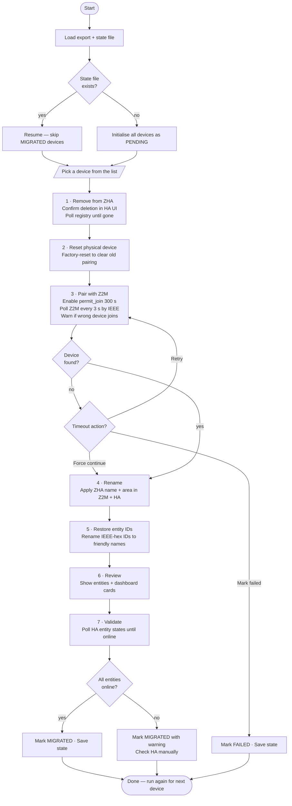
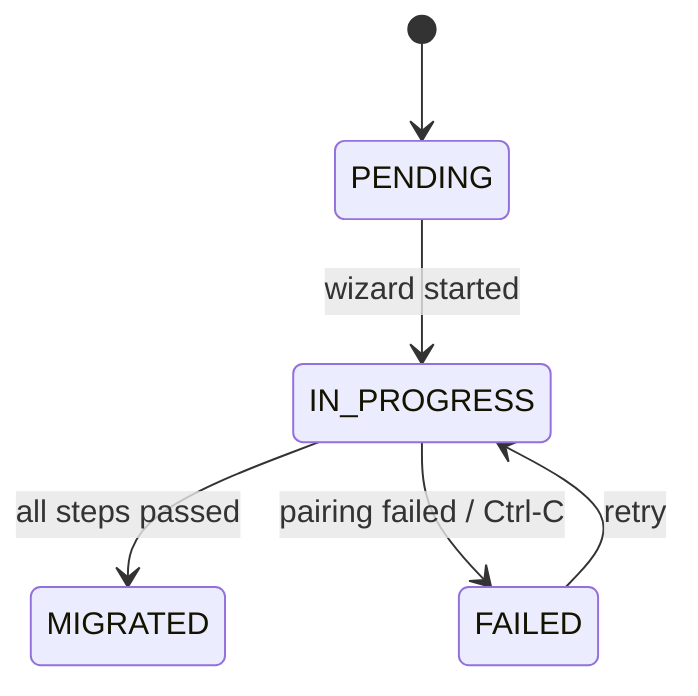

# Migration wizard

The wizard migrates one device at a time. Run it with:

```bash
zigporter migrate [ZHA_EXPORT]
```

`ZHA_EXPORT` defaults to `~/.config/zigporter/zha-export.json` (auto-created by `zigporter export`).
Check progress without entering the wizard:

```bash
zigporter migrate --status
```

## Steps

Each device passes through seven steps:

1. **Remove from ZHA** — triggers removal via the HA WebSocket API and polls the device registry until the device is gone
2. **Reset device** — prompts you to factory-reset the physical device to clear the old pairing
3. **Pair with Z2M** — opens a 300 s permit-join window and polls Z2M every 3 s by IEEE address; warns immediately if a different device joins by mistake
4. **Rename** — applies the original ZHA friendly name and area assignment in Z2M and HA
5. **Restore entity IDs** — renames IEEE-hex entity IDs back to friendly names
6. **Review** — displays current entity IDs and all Lovelace dashboard cards that reference them
7. **Validate** — polls HA entity states until all entities come online

### Pairing timeout options

If the 300 s pairing window expires without detecting the device, the wizard offers three choices:

- **Retry** — opens a new 300 s window
- **Force continue** — use this when you can see the device in Z2M with a green interview but automatic detection failed; the wizard proceeds using the IEEE address as a fallback name and the rename step corrects it
- **Mark as failed** — skip the device and revisit it later

## State persistence

Progress is written to `zha-migration-state.json` after every transition. Pressing `Ctrl-C` at any point marks the current device `FAILED` and saves — rerun the wizard to retry.

## Flow



## Device state machine


