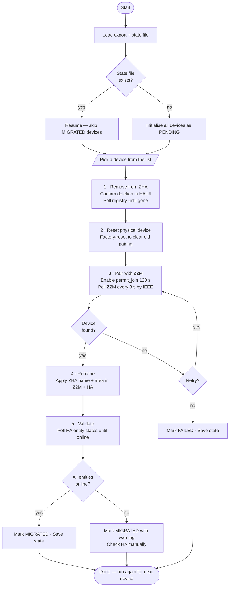
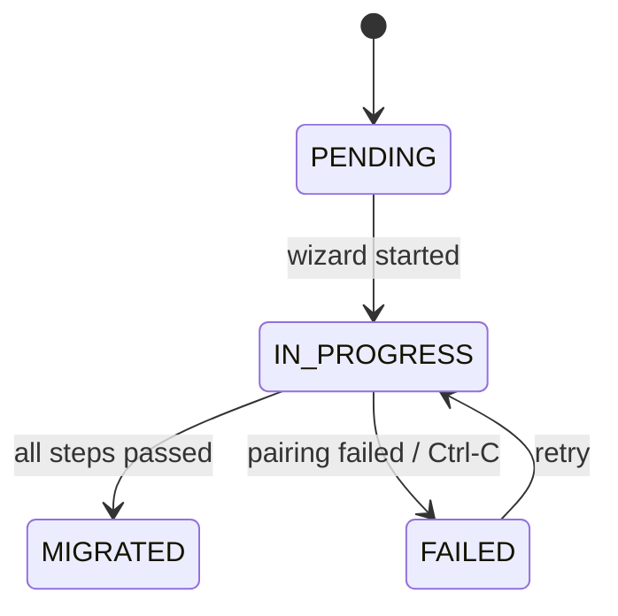

# Migration wizard

The wizard migrates one device at a time. Run it with:

```bash
zigporter migrate [ZHA_EXPORT]
```

`ZHA_EXPORT` defaults to the most recent `zha-export-*.json` in the current directory.
Check progress without entering the wizard:

```bash
zigporter migrate --status
```

## Steps

Each device passes through five steps:

1. **Remove from ZHA** — triggers removal via the HA WebSocket API and polls the device registry until the device is gone
2. **Reset device** — prompts you to factory-reset the physical device to clear the old pairing
3. **Pair with Z2M** — opens a 120 s permit-join window and polls Z2M every 3 s by IEEE address
4. **Rename** — applies the original ZHA friendly name and area assignment in Z2M and HA
5. **Validate** — polls HA entity states until all entities come online

## State persistence

Progress is written to `zha-migration-state.json` after every transition. Pressing `Ctrl-C` at any point marks the current device `FAILED` and saves — rerun the wizard to retry.

## Flow



## Device state machine


