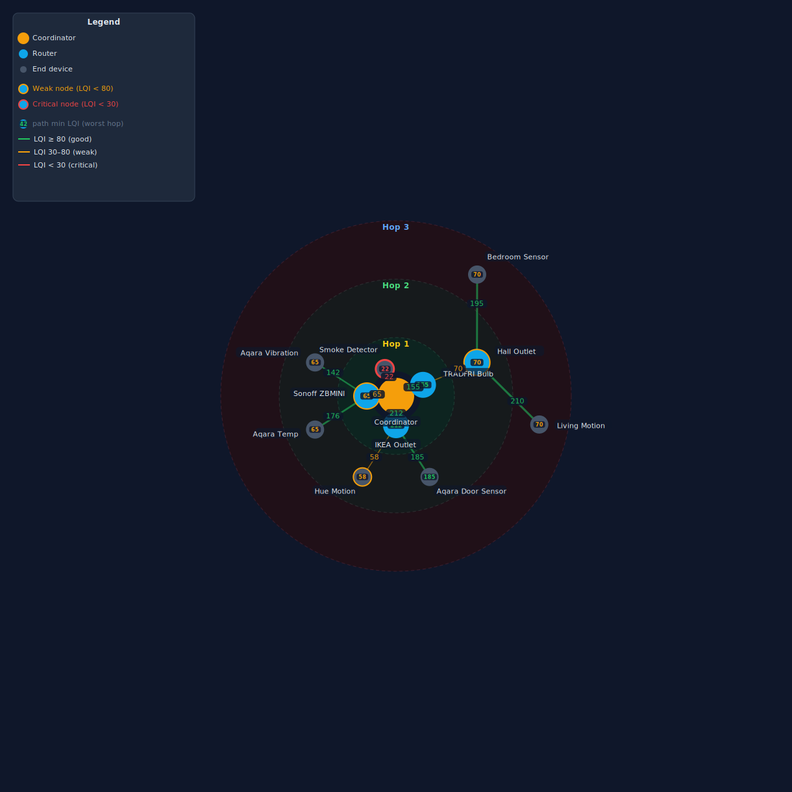

# network-map

Generate a radial SVG diagram of your Zigbee mesh with LQI-coloured edges, hop rings, and per-device signal badges — or print a routing tree and signal table straight to the terminal.

```bash
zigporter network-map
```

## Output formats

| Flag | Description |
|---|---|
| `--format tree` | Indented routing tree (default) |
| `--format table` | Flat table sorted by LQI ascending (weakest links first) |
| `--svg <file>` | Also export an SVG diagram |

## Compared to the Z2M network map

Z2M ships its own built-in network map (visible in the Z2M frontend). The two tools
show different things:

| | Z2M network map | `zigporter network-map` |
|---|---|---|
| Layout | Force-directed (positions are arbitrary) | Radial, hop-depth rings |
| Links shown | All neighbour links recorded during the scan | Active routing tree only |
| Hop depth | Hard to read — no visual grouping | Immediately visible by ring position |
| Readability | Lines overlap heavily in dense meshes | Clean tree with parent/child edges only |

The Z2M map is useful for seeing the full neighbour graph.  `zigporter network-map` is
useful for answering "which path does each device actually use, and how good is it?"

## SVG export example

```bash
zigporter network-map --output network.svg
```

[](../assets/network-map-demo.svg){ target=_blank title="Open full size" }

*Click the image to open full size in a new tab.*

## LQI thresholds

| Flag | Default | Meaning |
|---|---|---|
| `--warn-lqi` | 80 | Below this → shown in yellow as `WEAK` |
| `--critical-lqi` | 30 | Below this → shown in red as `CRITICAL` |

## Reading the output

```
Coordinator
    ├── Hallway Plug      [router]  LQI: 155  hops: 1
    │    └── SMLIGHT Repeater    [router]  LQI: 76  hops: 2  WEAK  (coord: 35)
    │        └── Attic Sensor    [end]     LQI: 62  hops: 3  WEAK  (coord: 39)
```

### LQI — what is it?

**LQI (Link Quality Indicator)** is a signal-strength score for Zigbee radio links.
0 = no signal, 255 = perfect.  Think of it like Wi-Fi bars, but for Zigbee.

### Zigbee is a mesh

Zigbee devices do not have to talk directly to the coordinator (your USB stick or
gateway).  They can **hop** through other devices — typically mains-powered plugs and
bulbs that act as routers.  A device with a weak direct link to the coordinator is
perfectly healthy if it has a strong link to a nearby router:

```
Device  ──76──►  Hall Plug  ──91──►  Coordinator
   └──────────────29────────────────────────────► (direct link, bad, not used)
```

The device routes through the plug.  The actual path quality is **76**, not 29.

### LQI (the main number)

The **routing path quality** — the bidirectional LQI between a device and its **routing
parent** in the tree.  Computed as `min(parent→device, device→parent)` using the Z2M
network-map scan data.  This is the quality of the edge drawn in the tree and reflects
the link the device actually uses to forward traffic.

Using the minimum of both directions matters because Zigbee links are asymmetric: a
device may hear the coordinator at LQI 115 while the coordinator only hears the device
at LQI 29.  The weaker direction is the real bottleneck.

### `(coord: N)` annotation

Shown in yellow or red for **depth > 1 devices** (those routing through at least one
intermediate router) when their **direct coordinator link** is below `--warn-lqi`.

This is the LQI the coordinator measured when it received a frame directly from the
device during the network scan.  This is **not** the same as the Z2M device card
badge (`last_linkquality`) — the badge reflects the LQI of the **final routing hop**
in the most recent application message, which can differ from both the routing path
LQI and the scan direct-coordinator LQI (see
[below](#why-the-z2m-badge-and-network-map-lqi-differ-for-routed-devices)).

The two numbers tell different stories:

| Value | What it means |
|---|---|
| `LQI: 76` | The device has a solid path through its routing parent (Hallway Plug) |
| `(coord: 35)` | If that router disappears, the fallback direct link to the coordinator is weak |

A device with a good routing LQI but a low `coord` value is **correctly routing around
a weak direct coordinator link** — that is healthy mesh behaviour.  The annotation is
there so you know the fallback path is poor if the parent router ever fails.

### Why the Z2M badge and `network-map` LQI differ for routed devices

Z2M's device card shows `last_linkquality` — the LQI of the **final routing hop** in
the most recently received application message.  For a Hop 1 device that talks
directly to the coordinator, this is the same link shown in the map.  For a deeper
device routing through an intermediate router, the badge measures the last
**router → coordinator** hop of whatever routing path was active when the last packet
arrived — which may be different from both the routing path the scan recorded and the
direct coordinator link shown in `(coord: N)`.

`network-map` shows the **routing path quality** (the edge in the tree) because that is
the correct label for the edge being drawn.  Putting the direct-coordinator number on a
line between the device and its routing parent would be misleading — it is a completely
different link.  The `(coord: N)` annotation exposes the direct scan measurement
alongside it so you have both pieces of information in one place.

#### Real-world example

The table below comes from an actual scan.  Hop 1 devices talk directly to the
coordinator, so the badge and scan LQI are measuring the same link and match closely.
Hop 2+ devices route through an intermediate router; the badge and the map LQI
diverge because they describe different links.

| Device | Hops | Z2M badge | Map LQI | Notes |
|---|---|---|---|---|
| Living Room Plug | 1 | 198 | 198 | Direct link — badge and map measure the same hop |
| Kitchen Plug | 1 | 172 | 172 | Direct link — badge and map measure the same hop |
| SMLIGHT Repeater | 2 | 155 | 76 | Badge = Hallway Plug→coord; map = device→Hallway Plug |
| Window Sensor | 2 | 172 | 71 | Badge = Kitchen Plug→coord; map = device→Kitchen Plug |
| Garage Plug | 3 | 76 | 105 | Badge = SMLIGHT→coord final hop; map = device→SMLIGHT hop |

## Z2M 2.x notes

Z2M 2.x does not publish retained MQTT messages on device state topics, so the live
`last_linkquality` overlay (which would update the routing-path LQI with real-time
values) has no effect in practice.  All LQI values shown come from the Z2M network-map
scan itself.

HA may also disable the `Linkquality` diagnostic sensor entity by default
(`"disabled_by": "integration"`).  Even if enabled, the value reflects the same direct
coordinator link shown in the `(coord: N)` annotation, not the routing path quality.

## Scan artifacts — LQI 0 on healthy devices

The network-map scan is a **point-in-time probe**.  Mains-powered routers occasionally
miss the scan request — they are busy forwarding application traffic or momentarily in
a radio back-off — and will appear with LQI 0 in the output even though they are
operating normally.

For example, `TRADFRI Outlet` in the demo SVG above shows `CRITICAL (LQI 0)` even
though it is a mains-powered router — this is a scan artifact.  If a device shows
`LQI: 0` or `CRITICAL` but its Z2M dashboard badge shows a healthy non-zero value,
re-run the command to get a fresh snapshot:

```bash
zigporter network-map --svg network.svg
```

A second scan will almost always show the correct value.  Persistent zeros on
mains-powered routers warrant further investigation (check Z2M logs for join/leave
events).

## Example — table format

```bash
zigporter network-map --format table --warn-lqi 100
```

```
Device                          Role    Parent               LQI   Hops  Status
──────────────────────────────────────────────────────────────────────────────
Hall Coatroom Led Light         end     Coordinator            0      1   CRITICAL
Outside Front Climate           end     Coordinator            6      1   CRITICAL
Förråd Smart Kontakt            end     Downstairs Left Plug  48      4   WEAK  (coord: 1)
```
